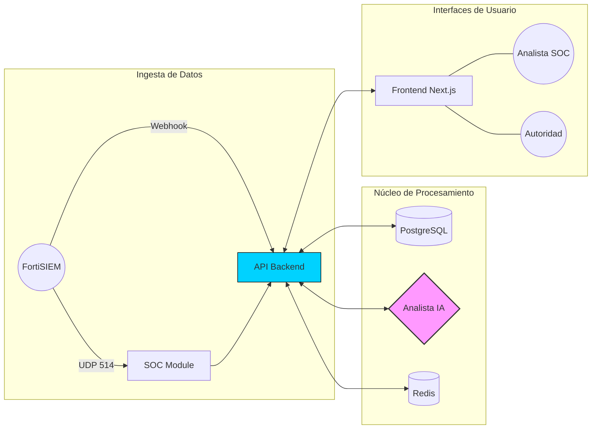

# 🛡️ Ticketera SOC
### Sistema Inteligente de Gestión de Incidentes de Seguridad


[](https://github.com/fldominguezz/Ticketera/actions/workflows/trivy-security.yml)
[](https://github.com/fldominguezz/Ticketera/actions/workflows/codeql.yml)

**Ticketera SOC** es una plataforma de software público diseñada específicamente para la orquestación, seguimiento y respuesta ante incidentes de ciberseguridad en el **Sector Público Nacional**. Integra capacidades de **Inteligencia Artificial** para asistir en el triage técnico y cumple con los más altos estándares de seguridad y transparencia institucional.

---

## 🗺️ Vista General de Arquitectura

El sistema opera bajo una arquitectura de microservicios robusta y resiliente:



---

## 🚀 Capacidades de Nivel Enterprise

*   **⚡ Monitor SOC (Radar):** Visualización en tiempo real de eventos críticos con latencia cero.
*   **🤖 Triage Asistido (LLM):** Automatización del primer nivel de análisis utilizando modelos de lenguaje avanzados.
*   **⚖️ Motor de SLA:** Gestión de tiempos de respuesta basada en normativas institucionales.
*   **🔒 RBAC Granular:** Control de acceso estricto. Cada usuario ve solo lo que su jerarquía le permite.
*   **🔎 Auditoría Inmutable:** Registro detallado de cada acción realizada sobre el sistema (Audit Logs).

---

## 🛠️ Stack Tecnológico

| Módulo | Tecnología |
| :--- | :--- |
| **Backend** | Python 3.11 + FastAPI |
| **Frontend** | React 19 + Next.js + TypeScript |
| **Bases de Datos** | PostgreSQL 16 + Redis |
| **Seguridad** | Nginx (TLS 1.3) + UFW Firewall |
| **Containerización** | Docker + Docker Compose |

---

## 🏛️ Cumplimiento Normativo

Este desarrollo ha sido auditado bajo el **Código de Buenas Prácticas en el Desarrollo de Software Público (ONTI)**:

-   **Virtualización:** Despliegue estandarizado y portable.
-   **Seguridad por Diseño:** Escaneos automáticos de vulnerabilidades (Trivy, Bandit, CodeQL).
-   **Protección de Datos:** Alineado con la **Ley 25.326** de Protección de Datos Personales de la República Argentina.
-   **Accesibilidad:** Soporte nativo para modos de **Alto Contraste** y **Dark Mode**, cumpliendo con las pautas de accesibilidad para software público (**WCAG 2.1 / Ley 26.653**).
-   **IA Responsable:** Procesamiento de IA **100% local** (sin fuga de datos a la nube) y bajo el principio de supervisión humana (*Human-in-the-Loop*).

---

## 📚 Documentación Técnica Adicional

Para más detalles sobre la operación y el cumplimiento del sistema, consulte:
*   [**Manual Operativo SOC**](docs/MANUAL_OPERATIVO_SOC.md)
*   [**Marco Legal y Normativo (Argentina)**](docs/MARCO_LEGAL_Y_NORMATIVO_AR.md)
*   [**Plan de Contingencia y Backup**](docs/CONTINGENCIA_Y_BACKUP.md)
*   [**Ética de IA y Privacidad**](docs/ETICA_IA_Y_PRIVACIDAD.md)
*   [**Guía de Instalación**](docs/INSTALLATION.md)

```bash
# Preparar entorno
git clone https://github.com/fldominguezz/Ticketera.git
cd Ticketera
cp .env.example .env

# Levantar plataforma completa
make start
```

---

## 📞 Institucional
**Desarrollado por:** Ayudante Dominguez Fernando
**Contacto:** [software-seguridad@pfa.gob.ar]
**Estado:** Producción / Estable
