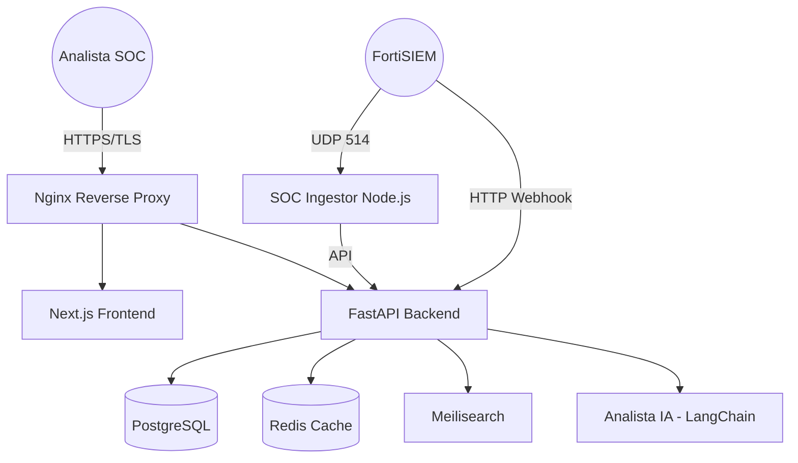

# 🛡️ Ticketera SOC - Gestión Inteligente de Incidentes de Seguridad

[](https://github.com/fldominguezz/Ticketera/actions/workflows/ci.yml)
[](https://github.com/fldominguezz/Ticketera/actions/workflows/trivy-security.yml)
[](https://github.com/fldominguezz/Ticketera/actions/workflows/gitleaks-security.yml)
[](https://github.com/fldominguezz/Ticketera/actions/workflows/bandit-security.yml)
[](https://github.com/fldominguezz/Ticketera/actions/workflows/codeql.yml)

**Ticketera SOC** es una solución de software público diseñada para la orquestación, gestión y respuesta ante incidentes de ciberseguridad. Optimizado para el **Sector Público Nacional**, integra capacidades de inteligencia artificial para el triage de alertas y un sistema robusto de seguimiento de tickets alineado con normativas institucionales.

---

## 🏗️ Arquitectura del Sistema

El sistema utiliza una arquitectura de microservicios contenerizados, garantizando alta disponibilidad y aislamiento de fallos.



---

## 🌟 Características de Nivel Institucional

### 1. Ingesta Multi-Fuente (SOC Radar)
Monitoreo en tiempo real de eventos provenientes de FortiSIEM, FortiGate y logs de sistema. Capacidad de procesamiento UDP y Webhooks.

### 2. Triage Asistido por IA
Análisis automático de logs crudos (`raw logs`) mediante modelos de lenguaje (LLM), proporcionando resúmenes ejecutivos y recomendaciones de remediación inmediatas.

### 3. Control de Acceso Basado en Roles (RBAC)
Gestión granular de permisos. Los usuarios solo acceden a las funciones y datos correspondientes a su jerarquía (Analista, Coordinador, Auditor, Administrador).

### 4. Gestión de Activos y CMDB
Relación directa entre incidentes e infraestructura crítica, permitiendo identificar rápidamente el impacto de una amenaza en la red institucional.

---

## 📜 Cumplimiento y Estándares

### Buenas Prácticas ONTI
Este proyecto cumple con la **Guía Técnica para el Desarrollo Sustentable de Software en la Administración Pública**:
- ✅ **Virtualización:** Despliegue 100% basado en contenedores Docker.
- ✅ **Seguridad por Diseño:** Escaneos automáticos de vulnerabilidades (Trivy, Bandit, CodeQL) en cada commit.
- ✅ **Interoperabilidad:** API documentada bajo estándares OpenAPI 3.0.
- ✅ **Accesibilidad:** Interfaz diseñada para múltiples temas visuales, incluyendo **Modo Alto Contraste** y **Modo SOC**.

### Protección de Datos Personales (Ley 25.326)
- Auditoría inmutable de todas las acciones sobre tickets.
- Minimización de datos en el registro de usuarios.
- Cifrado de datos sensibles en tránsito (TLS 1.3).

---

## 🚀 Despliegue Rápido

### Requisitos Previos
- Docker Engine >= 24.0.0
- Docker Compose >= 2.20.0

### Instalación
```bash
# Clonar y preparar entorno
git clone https://github.com/fldominguezz/Ticketera.git
cd Ticketera
cp .env.example .env

# Iniciar plataforma
make start
```

---

## 📞 Soporte e Institucional
**Desarrollado por:** División Seguridad Informática - PFA
**Contacto Técnico:** [software-seguridad@pfa.gob.ar]
**Versión Actual:** 1.0.0 (Estable)
