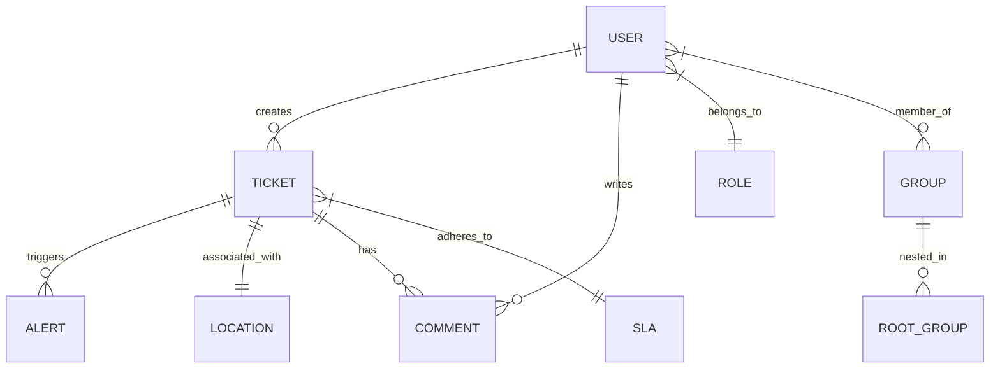

# Modelo de Datos y Entidades

Este documento describe la estructura lógica de la base de datos PostgreSQL del sistema **Ticketera SOC**.

## Diagrama de Entidades (Simplificado)

## Entidades Principales

### 1. Usuarios y Seguridad
*   **users:** Almacena la identidad, email (único), hash de contraseña (Argon2) y estado de 2FA.
*   **roles:** Define los niveles de acceso (Admin, Analista, Operador).
*   **audit_logs:** Registro inmutable de acciones administrativas y de seguridad.

### 2. Organización
*   **groups:** Agrupaciones lógicas de usuarios para asignación de tickets.
*   **root_groups:** Estructura jerárquica de alto nivel (ej: Direcciones, Divisiones).
*   **locations:** Jerarquía de dependencias físicas o funcionales vinculadas a activos.

### 3. Gestión de Incidentes
*   **tickets:** El núcleo del sistema. Contiene título, descripción, estado (Nuevo, Abierto, Cerrado), prioridad y timestamps (UTC).
*   **ticket_comments:** Hilo de seguimiento técnico para cada incidente.
*   **alerts:** Datos crudos provenientes del SIEM vinculados a un ticket.

### 4. Niveles de Servicio
*   **sla_policies:** Definición de tiempos de respuesta y resolución según prioridad y categoría.
